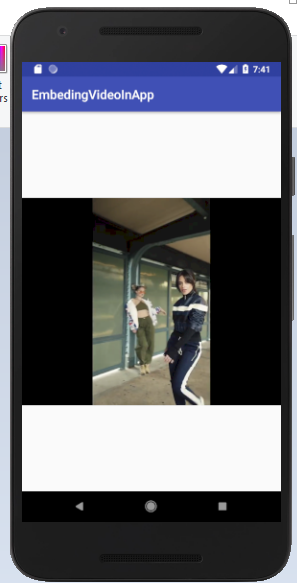

# EmbedingVideoInApp
The steps to embedde and play in app videos

------------------
step 1 :  place the video file you want to be displayed in the "raw" folder ( you'll have to create this folder ) in the resources folder
step 2 :  add the VideoView widget the the app layout ( in activity_main.xml )
step 3 : now you have to attach the video to the video view .. for that first initialise VideoView in the onclick method and get the
  videoview widget object  using findViewById()
step 4 : next you've got to set the path to the video for the videoView
step 5 : now you need a mediaController object to have control over the playing of the video
step 6 : next you need to connect the mediaController to the videoView you want it to  control using the setAnchorView method
step 7 : next you  need to connect the videoView to the controller that's it's allowing it to be controlled by (mediaController)
step 8 : finally start the video
-------------------

 
 Video :
 
 
